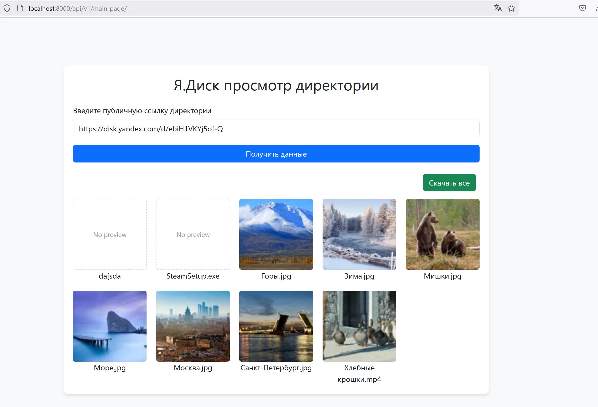

# Single Page для просмотра Я.Диск по публичной ссылке

## Запуск
Необходимо наличие Python3.8 и менеджер пакетов/окружений Poetry (1.7.1). 

Зайти в проект `yandex-disk-test`, создать виртульное окружение:
```shell

cd yandex-disk-test
poetry env use 3.8
```

Сделать окружение активным и установить зависимости:
```shell

poetry shell
poetry install
```

Запуск стандартно через
```shell
python manage.py runserver localhost:<PORT:-8000>
```

Перейти в браузере на http://localhost:8000/api/v1/main-page/

## Реализовано:
1. Подгрузка файлов из публичной ссылки, превью, название
2. Скачивание файла по нажатию на его превью

*Кнопка "Скачать все" не работает 

1. Вид страницы:


2. После ввода ссылки и нажатия на кнопку:


3. Скачивание по нажатию на превью:


4. При последующем вводе невалидной сслыки и нажатии на кнопку:


## Технические моменты
HTML шаблон страницы привязан к class based API, где на POST запрос 
от кнопки происходит валидация переданного публичного ключа. Далее по средствам
специального класса `YandexDiskIntegration` происходит получение и обработка полученных данных,
которые потом идут в шаблон.